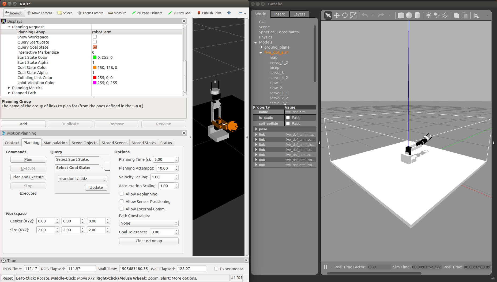

# five_dof_robot_arm
ROS implementation of the aluminium chinese built 5-6 DOF robot arm. My implementation has 5 DOF because the servos used were too weak to even support the arm itself.

As for all my repositories so far, this is simply a way for me to document my projects in robotics. If you wish to replicate this robot arm, I suggest looking into Mastering ROS For Robotics Programming book. It doesn't explicitely tell you how to implement it with the arduino but you will have enough insight to do it yourself.

- This robot can follow a trajectory dictated by MotionPlanning (MoveIt!). 
- You can also use sliders or joysticks to control it manually. If the switch's on, joystick control is enabled. Otherwise, slider/software control is enabled.
- The robot can be vizualised with RViz and Gazebo. 
- A placeholder function can make it learn a sequence and play it back to you. It is still under work. 
- Essentially, a node reads the five_dof_arm/Joint_states and publishes them to the arduino.

# A. Software prerequisites
  0. Ubuntu 16.04+
  1. ROS kinetic
  2. MoveIt!, Gazebo and controller plugins. (refer to chapters 2 to 4 from  http://pdf.th7.cn/down/files/1603/Mastering%20ROS%20for%20Robotics%20Programming.pdf)
  3. rosserial_arduino (see http://wiki.ros.org/rosserial_arduino/Tutorials)
  
# B. Hardware requirements
  1. Arduino board (nano in my case)
  2. 6 DOF robot arm from ebay/banggood/aliexpress (ex: https://www.ebay.com/p/1-Set-Black-6-DOF-Aluminium-Mechanical-Robotic-Arm-Clamp-Claw-Mount-Robot-Kit/1332691537?iid=191996564536)
  3. 4 analog 2-axis joysticks
  4. Jumper wires
  5. Switch (or simulate it with a wire)
  
# C. Installation
  1. Prepare all the hardware. Refer to the arduino code found in arduino_implementation.
  2. Download all the software.
  3. $ roscore
  4. $ roslaunch five_dof_arm five_dof_arm_control.launch
  5. $ rosrun rosserial_python serial_node.py /dev/ttyUSB'n' _ baud:= 115200
  
